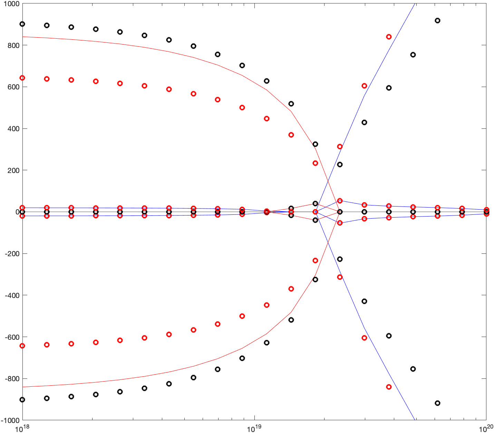

# Summary

It is often of interest to plasma physicists to know which plasma waves can propagate in a magnetized plasma at a given frequency. The calculation of such reduces to solving for which $k_{\perp}$ (or $k_{\parallel}$) the 0-D time-harmonic wave equation operator has zero determinant. For a cold (i.e., no finite-temperature effects) magnetized plasma, simple analytic polynomial expressions for this problem are available in several texts [@stix1992waves; @brambilla1998kinetic; @swanson2003plasma] and $k_{\perp}(\omega)$ (or $k_{\parallel}(\omega)$) being solveable via the quadratic equation. However, for a hot plasma where finite-temperature effects must be included, the problem becomes one of non-linear root finding with a rather complex objective function. As such, dispersion solvers for hot magnetized plasmas are not readily available. This repository aims to make available this capability for Matlab.  

``dispersioneering`` is a Matlab package for calculating the general dispersion relation for hot or cold magnetized plasmas assuming Maxwellian distrubtion functions. It allows 1-D specification of plasma profiles of magnetic field $B(x)$ (T), density $n(x)$ ($m^{-3}$), and temperature $T(x)$ (eV) for an aribtrary number of species at a specified frequency. It calculates both hot and cold solutions, with the harmonic number an input parameter for the hot calculation. The code is formulated as finding the roots of the determinant of the 0-D wave equation, which in is written in terms of the dielectric tensor $\epsilon$. For the hot plasma dielectric we rely on spline interpolation from a plasma dispersion function tabulated on a non-uniform grid in its real argument. This tabulation (found in the `zFunction.nc` netCDF file) is generated by the Mathematica notebook `mathematica/zFunction.nb`. The function is tabulated to large enough real argument such that in the analytic expressions we use in ``dispersioneering`` beyond the extents of the table are accurate. 

For a calculation of $k_{\perp}$, inputs are the range and resolution over which to scan the initial 2-D guess space of (Re($k_{\perp}$),Im($k_{\perp}$), the number of spatial locations, and function handles describing the magnetic field, density and temperature profiles.  

The below figure shows an example output of ``dispersioneering`` where the solid lines are cold plasma solution, and the circles are the hot plasma solution, with black being Re($k_{\perp}$) and red being Im($k_{\perp}$).

*test*

# Acknowledgements

We acknowledge useful discussions with Donald B. Batchelor, and Juan Marin-Caneses for motivating this work.

# References
